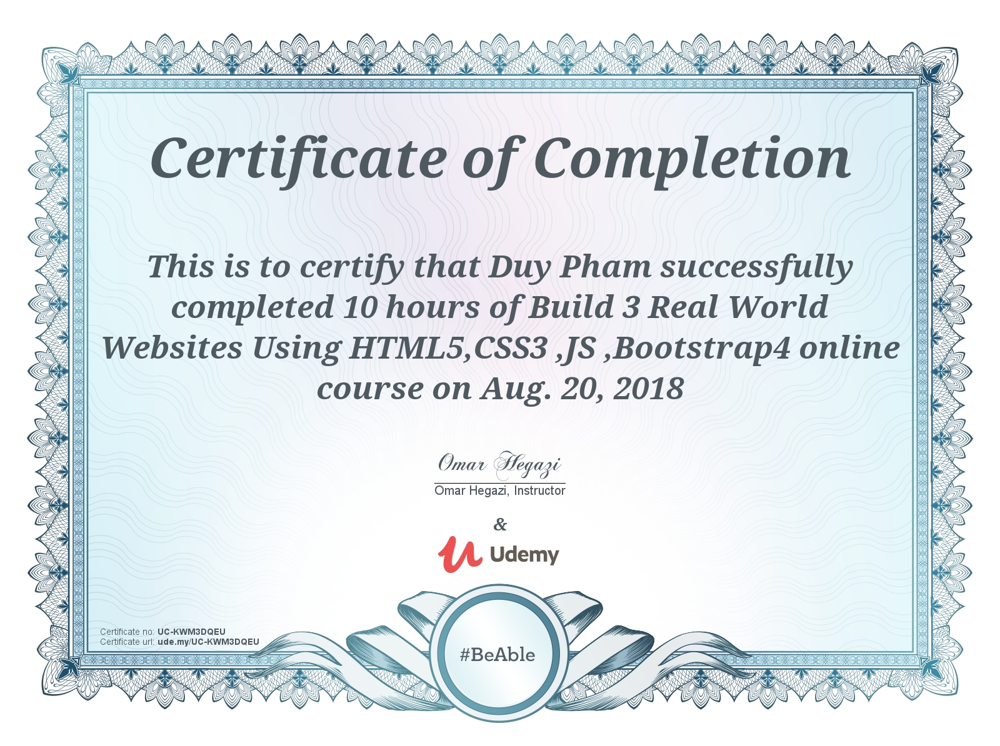
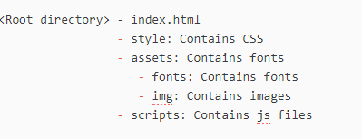
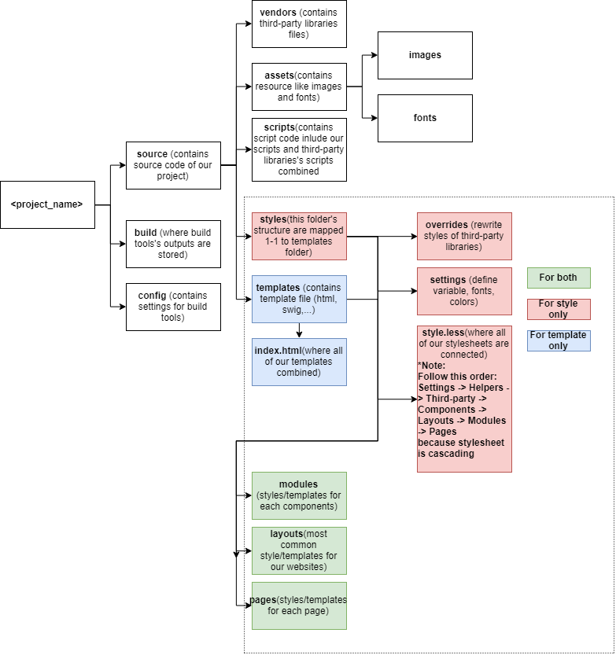

# Building 3 Responsive Real World Website Using HTML5, CSS3, JS, And Bootstrap 4

## Planing

- Expected time: 59 hours
- Finish day: 20/08/2018
- [Study Schedule](https://docs.google.com/spreadsheets/d/1neYsKRH3Zm8IyodvKLy6-J1sxobf81SpwaFINCIpgyk/edit?usp=sharing)

## Certificate

## Day 1: 12/08/2018

### Today's progress

Finish lesson 1: Why this Course and Course plan

- Get the purpose of the course
- List out overall content for the course

Finish lesson 2: Editor

- Choose for yourself an IDE( VS Code as the course suggested)
- Discover some built-in features of VS Code
- Install some package for VS Code

Finish lesson 3: Adobe Photoshop Essentials

- How to convert a PSD to a full working website
- Explain photoshop tools

### Thoughts

- Struggle with Git a little bit.
- The documentation is more time-consuming than expected.
- Spend some time on markdown hyperlink
- The markdown preview of VSCode show wrong indentation.
- Markdown show up in gitlab and atom differently which blocks
- The lesson is like a walk in the park not as hard as i expected

### Links to work

[Details of lesson 1](./chapter-1-introduction-and-course-essentials/README.md#why-this-course-and-course-plan)

[Details of lesson 2](./chapter-1-introduction-and-course-essentials/README.md#editor)

[Details of lesson 3](./chapter-1-introduction-and-course-essentials/README.md#adobe-photoshop-essentials)

## Day 2: 13/08/2018

### Today's progress

Finish lesson 4: Bootstrap 4

- Discuss some of the neccessary and most used bootstrap components and ultilities

### Thoughts

- Phew, Pretty long documentation
- The video is a bit hard to listen

### Links to work

[Details of lesson 4](./chapter-1-introduction-and-course-essentials/README.md#bootstrap-4)

## Day 3: 14/08/2018

### Today's progress

Finish lesson 5: Preprocessors SASS vs LESS

- Find out what is SASS and LESS, why use them and give some examples

### Thoughts

- A little confusion comes from the naming of Sass and Scss.
- The `yarn global add node-sass` does not work, use `npm install node-sass -g` instead

### Links to work

[Details of lesson 5](./chapter-1-introduction-and-course-essentials/README.md#preprocessors-sass-vs-less)

## Day 4: 15/08/2018

### Today's progress

Finish lesson 6: Trello The Project Manager

- What is Trello and why it's helpful
- How to use

Finish lesson 7: OpenCharity Overview

- An overview on the website that we are going to clone

Finish lesson 8: Prepare files

- Build project folder structure
- Convert PSD file to some neccessary assets
- Integrate Bootstrap 4

Finish lesson 9: Linking Files + Implement Style Sheet

- Link CSS and JS files to index.html
- Implement CSS of our own with less

### Thoughts

- The Trello lesson is easy.
- Finding fonts and download them for free is time-consuming
- The photoshop move tool does not work properly, so inpecting elements to export struggle a bit, attempting to fix it.
- Lesson 9 is plain coding with no explaination or visual comparision

### Links to work

**Link to GitHub Project**: [OpenCharity](https://github.com/duyphaphach/Open-Charity)

[Details of lesson 6](./chapter-1-introduction-and-course-essentials/README.md#trello-the-project-manager)

[Details of lesson 7](./chapter-2-opencharity-website/README.md#opencharity-overview)

[Details of lesson 8](./chapter-2-opencharity-website/README.md#prepare-files)

[Details of lesson 9](./chapter-2-opencharity-website/README.md#linking-files-implementing-style-sheet)

## Day 5: 16/08/2018

### Today's progress

Finish lesson 10: Navbar Part 1

- Implement styles for Navigation Bar

Finish lesson 11: Navbar Part 2

- Implement event-handlers for Navigation bar

Finish lesson 12: Header Part 1

- Implement page header sections

Finish lesson 13: Header Part 2

- Finish page header sections

Finish lesson 14: Get Involved Section

- Implement UI for GET INVOLVED Section

### Thoughts

- Just mirror coding without any further explaination

### Links to work

**Link to GitHub Project**: [OpenCharity](https://github.com/duyphaphach/Open-Charity)

[Details of lesson 10](./chapter-2-opencharity-website/README.md#navbar-part-1)

[Details of lesson 11](./chapter-2-opencharity-website/README.md#navbar-part-2)

[Details of lesson 12](./chapter-2-opencharity-website/README.md#header-part-1)

[Details of lesson 13](./chapter-2-opencharity-website/README.md#header-part-2)

[Details of lesson 14](./chapter-2-opencharity-website/README.md#get-involved-section)

## Day 6: 17/08/2018

### Today's progress

Finish lesson 15: Mission Section

- Implement UI for Mission Section

Finish lesson 16: Members Section

- Install Owl Carousel 2
- Implement UI for Member Section

Finish lesson 17: Event Section

- Implement UI for Event Section

Finish lesson 18: Blog Section

- Implement UI for Blog Section

Finish lesson 19: Contact Section and Footer

- Implement UI for Contactc Section
- Implement UI for Footer

Finish lesson 20: Enhancements

- Add animation, fix responsive bugs, make changes to UI

Finish lesson 21: Testing

- Cover some remaining issues about UI, animation,..
- Increase website performance
- Do some testing

### Thoughts

- Just mirror coding

### Links to work

[Details of lesson 15](./chapter-2-opencharity-website/README.md#mission-section)

[Details of lesson 16](./chapter-2-opencharity-website/README.md#members-section)

[Details of lesson 17](./chapter-2-opencharity-website/README.md#event-section)

[Details of lesson 18](./chapter-2-opencharity-website/README.md#blog-section)

[Details of lesson 19](./chapter-2-opencharity-website/README.md#contact-section-and-footer)

[Details of lesson 20](./chapter-2-opencharity-website/README.md#enhancements)

[Details of lesson 21](./chapter-2-opencharity-website/README.md#testing)

## Day 7: 18/08/2018

### Today's progress

Finish lesson 22: Recap

- Review what we have built

Finish lesson 23: 404-Overview

- Prepare for the 404-penguins-page

Finish lesson 24: Prepare Files

- Build project folder structure
- Extract neccessary images from psd file
- Import in neccessary css.

Finish lesson 25: Start Code

- Implement UI
- Styling Page
- Add animation

Finish lesson 26: Recap

- Advices on project

Finish lesson 27: Merkury Overview

- Overview on what are we going to build

Finish lesson 28: Prepare Files

- Apply Trello steps

Finish lesson 29: Linking Files

- Link image and library with index.html
- Apply some custom CSS

### Thoughts

- Spend some time on Trello stuffs

### Links to work

[Details of lesson 22](./chapter-2-opencharity-website/README.md#recap)

[Details of lesson 23](./chapter-3-404-penguins-page/README.md#404-overview)

[Details of lesson 24](./chapter-3-404-penguins-page/README.md#prepare-files)

[Details of lesson 25](./chapter-3-404-penguins-page/README.md#start-code)

[Details of lesson 26](./chapter-3-404-penguins-page/README.md#404-recap)

[Details of lesson 27](./chapter-4-merkury-website/README.md#merkury-overview)

[Details of lesson 28](./chapter-4-merkury-website/README.md#prepare-files)

[Details of lesson 29](./chapter-4-merkury-website/README.md#linking-files)

## Day 8: 19/08/2018

### Today's progress

Finish lesson 30: Navbar Part 1

- Implement styles for Navigation Bar

Finish lesson 31: Navbar Part 2

- Add some enhancements to make our navbar more interactive

Finish lesson 32: Header

- Implement UI for page header section

Finish lesson 33: Service Section

- Implement UI for service section

Finish lesson 34: Features Section

- Implement UI for Features section

Finish lesson 35: Drag and Drop Section Part 1

- Implement Skeleton for Drag and Drop section

Finish lesson 36: Drag and Drop Section Part 2

- Implement Style for Drag and Drop section

Finish lesson 37: Template Section

- Implement UI for Template Section

Finish lesson 38: Pricing Section

- Implement UI for Pricing Section
- Remind of Box shadow CSS

Finish lesson 39: Join and Footer Section

- Implement UI for Join Section
- Implement UI for Footer Section
- Remind of `:before`, `:after` and `display: flex`

### Thoughts

- Problem with git pushing, SSH key added but still require manually Authentication, pushing takes too much time, fail sometimes
- The course does not go into details of CSS keyframe, jQuery and jQueryUI, just mention syntaxes and some functionalities. Research on them later on.

### Links to work

[Details of lesson 30](./chapter-4-merkury-website/README.md#navbar-part-1)

[Details of lesson 31](./chapter-4-merkury-website/README.md#navbar-part-2)

[Details of lesson 32](./chapter-4-merkury-website/README.md#header)

[Details of lesson 33](./chapter-4-merkury-website/README.md#service-section)

[Details of lesson 34](./chapter-4-merkury-website/README.md#features-section)

[Details of lesson 35](./chapter-4-merkury-website/README.md#drag-and-drop-section-part-1)

[Details of lesson 36](./chapter-4-merkury-website/README.md#drag-and-drop-section-part-2)

[Details of lesson 37](./chapter-4-merkury-website/README.md#template-section)

## Day 9: 20/08/2018

### Today's progress

Finish lesson 38: Pricing Section

- Implement UI for Pricing Section
- Remind of Box shadow CSS

Finish lesson 39: Join and Footer Section

- Implement UI for Join Section
- Implement UI for Footer Section
- Remind of `:before`, `:after` and `display: flex`

Finish lesson 40: Enhancements

- Make website more responsive
- Apply some effect to increase smoothness

Finish lesson 41: Testing

- See what can we improve

Finish lesson 42: Recap

- Revise what we have learnt so far

Finish lesson 43: Important Tips

- Share some important tips and advices

### Thoughts

- Problem with git pushing, SSH key added but still require manually Authentication, pushing takes too much time, fail sometimes
- The course does not go into details of CSS keyframe, jQuery and jQueryUI, just mention syntaxes and some functionalities. Research on them later on.
- More stuffs to research: `flexbox`, `box-shadow`, psuedo classes CSS
- The guideline on Scroll Reveal section is outdated
- The deployment and image compressing and speed test take freaking long time

### Links to work

[Details of lesson 38](./chapter-4-merkury-website/README.md#pricing-section)

[Details of lesson 39](./chapter-4-merkury-website/README.md#join-and-footer-section)

[Details of lesson 40](./chapter-4-merkury-website/README.md#enhancements)

[Details of lesson 41](./chapter-4-merkury-website/README.md#testing)

[Details of lesson 42](./chapter-4-merkury-website/README.md#recap)

[Details of lesson 43](./chapter-4-merkury-website/README.md#important-tips)

## Day 10: 26/08/2018

Some tips on front-end developments:

**Folder structure**

**Step to convert PSD to HTML and CSS**

- Build html files first.
- Inspect color, font size, spacing
- Convert font-size, color, spacing to CSS
- Add animation, effects

### Thoughts

- Add CSS to ensure color and spacing need 1 to 1 precision.

## Day 11: 29/08/2018

Config build tools and Steps to create skeleton HTML

* * *

**New folder structure**

**Note**:

The `index.js` in scripts folder should import style.less

The `style.less` should include banner, like:

/_ Open Charity style _/

* * *

**Tips on setting up Build tools**

Webpack

Should hash output filename after build to support auto clearing cache at client

Gulp

**Steps to install**

1. Create `gulp` folder and `gulpfile.js`
2. Install gulp `yarn add gulp --ignore-engines`
3. Install `require-dir`
4. Config `gulpfile.js`
  - gulp/util.js: for logging
  - gulp/concat.js: concat files
  - gulp/gulp-size.js: Alert file size after build

**Note**

Gulp's tasks naming:

For development: `scripts:vendor:compile`

For production: Add prefix `production`

* * *

**Create Skeleton HTML**

Prepare resource:

1. Open design file with Photoshop
2. Resize PSD file if it's too large using Image/Image Size...
3. Extract color, fonts and images and note down/save them

Connect resource to our project

**With fonts**

Always include all font type : oet, woff, ttf for cross-browser support

Suggest [fontsquirrel](https://www.fontsquirrel.com/) to generate font kit from one file type

The font kits from internet usually include demo document, use their css to quickly define fonts

**With color**

Use [chir.ag](http://chir.ag/projects/name-that-color/#6195ED) to name color and turn colors into `less` variables

Define color class for text and background

- Text: .text-&lt;color_name>
- Background: .bg-&lt;color_name>

**With image**

Rename them to describe where they would be used in website

Naming convention: Using \_ to separate words, \_\_ to represent child component

Ex: Image used for item 2 of section 2: `section_1__item_2.png`

* * *

Writting HTML

Name `class` and `id` right:

**With class**

Follow Semantics UI: `primary button`, `facebook item`, `facebook item-1`

**With ID**

Use \_ to separate words and ** to represent child components: \`footer**social_links\`

**Note**

- Class and ID should be used mixed.
- Classes are used for common styling, describing component
- IDs are used for quicker queries.
- Writing HTML should avoid over thinking

## Day 12: 07/09/2018

### Today's progress

Perfect pixel website without resizing design file

Front-end tips and tricks

Introduce some linting tools and optimize tools

### Details

**Perfect pixel website without resizing design file**

Scale down screensize for fitting PSD file better

* * *

**Front-end tips and tricks**

How to use padding and margin properly: 

- Padding should be used for nesting containers
- Margin should be used for adjusting spacing between elements
- Margin must not be used together with position
- Tag containing background should be put on top of its container

* * *

How to use `button` and `a` tag with class `button` properly:

- `a` with class `button` tags should be used for navigating
- `button` should be used for form and action only

* * *

Naming convention update:

- `.list` should contain `.item`
- `.row` should contain `column`
- Avoid abbreviations to keep template semantic.

* * *

**Introduce some linting tools and optimize tools**

Some linting tools to be applied in near future: 

- ESlint
- CSSlint
- Husky + lint-staged

Linting configuration file: `.editorconfig`

Some linting tools for reference:

- prettier

* * *

Optimizing tools to be applied:

- Minify CSS.
- Minify JS
- Minify HTML (experimenting)

Some Optimizing tools for reference:

- prepack.io (developing)

## Day 13: 12/09/2018

### Today's progress

Naming convention update

Front-end tips and tricks

Some strays on the modern web design world

Introduce some web optimization techniques

Introduce regression test

### Details

**Naming convention update**

Vocabularies:

Classes:

`.title` (For section, for card),

`.content`(For section),

`.description`(Esp for card),

`.meta`(Additional information, use with descriptive classes like `time`, `date`, `price`, `discount`, wrapped with ``),

`.action`(For button),

`.thumbnail`

`.row > .column`,

`.list > li.item`

* * * 

**Front-end tips and tricks**

New rules:

1. Restrict on using `.container-fluid`, using `.container` and override `@container-md` ,`@container-sm`, `@container-sm`
2. Using css `class` for defining fonts
3. Color and background color class pattern: `color-[color-name]`, `background-[color-name]`
4. Bootstap `.row`s should be only applied to `.row > .column`s
5. Font's filename: `"Font-Name.[ext]"`
6. font-family define: `'Font Name'`
7. Using CSS over JS creating animations

Template structure:

* * * 

**Some strays on the modern web design world**

Avoid FOUT, FOIT, FOFT

[Readmore](https://css-tricks.com/fout-foit-foft/)

Some popular Design Systems

1. Bootstrap
2. Zurb Foundation
3. Semantic UI

* * *

States of digital websites

1. Full (Interacting)
2. Loading (Interacting)
3. Error
4. Error
5. Empty
6. Edge cases

* * *

**Introduce some web optimization techniques**

**With Javascript**

1. Minify JS
2. Obfuscate JS (encode to avoiding reversing)

**With CSS**

1. Minify CSS
2. Critical CSS (determine some important CSSes to be applied before all CSSes are loaded to create `First meaningfull paint` )
3. Remove unused CSS using 

**With HTML**

1. Minify

**With Images and fonts0**

1. Compress images and fonts

* * *

**Introduce regression test**

Apply regression test and its importance in frontend development

