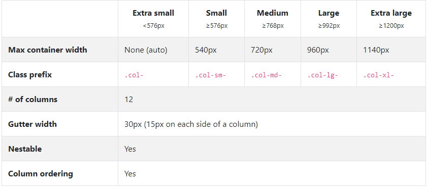
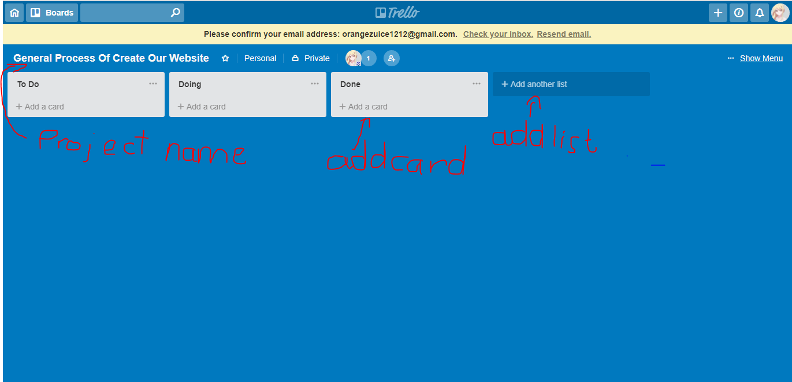
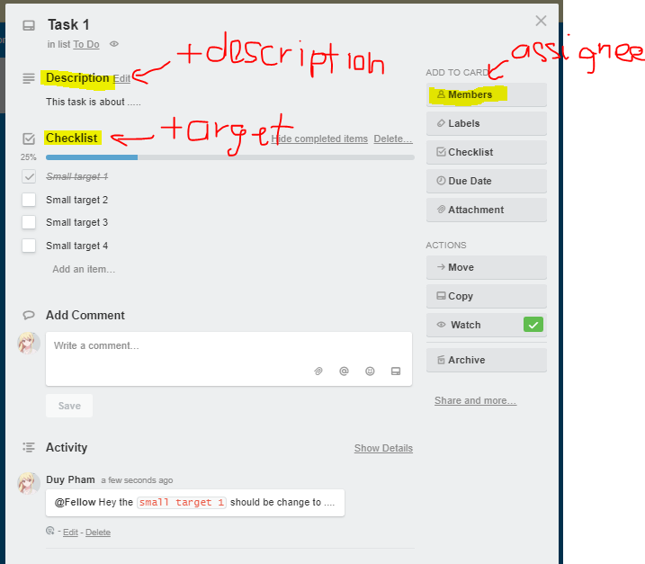

## Chapter 1: Introduction + Course Essentials

#### Why this Course and Course plan
**Overview:**

Understand the purpose of taking this course and give out the course plan

**Details:**
- Top 5 reasons:
  1. Technology are introduced along with practical projects
  2. Step by step lead you from exporting elements of Photoshop Design till you Deliver a full working responsive production website to client (the combination of design and coding is very usual in big companies)
  3. Concern testing and optimization.
  4. Provide three different stunning website in one course with different ideas and carefully chosen design.
  5. Simplify the knowledges of technologies used and combine them.
- The testing includes:
  - Cross browser test
  - Markup validation service
  - Speed and performance test
- Enhancements includes:
  - Responsive test
  - Compressing images

- Course planning:

  1.Adobe Photoshop:
    - How to use to export elements to psd files
    - How to get the colors and fonts of your website
    - Tools that front-end developers/designer should know
    - How to control layers and useful shorcuts

  2.Bootstrap 4:
    - Introduce Bootstrap 4 grid system by examples
    - How to use components like navbar, cards, forms, dropdown, scroll spy and more
    - Further explanation of the most common bootstrap 4 classes

  3.CSS Preprocessors SASS and LESS
    - Full explanation about preprocessors by examples
    - Definition and why use them ?
    - Different between SASS and LESS
    - How to install
    - Features of SASS and LESS by examples

  4.Trello Project Manager
    - What is Trello
    - Why we use it
    - How we can use it to organize our project steps and keep the clients aware of the project progress

  5.The Open Charity website
    - How to prepare website files
    - Write clean and reusable code  with comments for every section
    - Use LESS in our style sheet
    - Use some of the bootstrap components
    - How to make scroll spy as well as smooth scroll
    - Write some jQuery animations
    - User a plugin called owl slider to make two different sliders and how to customize your slider easily
    - Use animated.css to animate some elements
    - Check the responsive plus optimize the website speed and performance and run three different tests on website

  6.The 404-penguins page
    - Learn how to make advanced css keyframes and animations plus positioning

  7.Merkury Website
    - Go over some of subjects that we have learned in the past projects
    - Learn how to make advanced animations with css keyframes and jQuery
    - Use bootstrap 4 ultility classes
    - Use CSS before and after selectors
    - How to combine between bootstrap 4 cards dropdown and customize them
    - Learn how to use jQuery UI library to apply advanced events on elements
    - Learn how to use scroll reveal plugin to animate elements while scrolling
    - Finding solutions and workarounds and more
    - Check responsive and optimize website performance and speed along with running test on website

**Bookmarks:** None

#### Editor

**Overview:**

Introduce VS Code Editor

**Details:**

- Customize setting: File/Preference/Settings a tab appear to let you put on your own style
- VS Code comes with built-in terminal, (expand from the bottom)
- Install the following package for compling preprocessors SASS and LESS
  1. Ctrl + Shift + X to open Extensions
  2. Search and install Easy LESS(compile LESS to CSS on save), Live SASS compiler(compile SASS or SCSS to CSS, come with live server to support hot reloading), Sass (Sass syntax highlighting, autocomplete and snipets)
- Install Dracula Theme through Extensions.

**Bookmarks:** [Download and Documentation VSCode](https://code.visualstudio.com/docs/languages/markdown)

#### Adobe Photoshop Essentials
**Overview:**

Adobe Photoshop Essentials

**Details:**

- Image Exporting program that help to convert PSD to HTML and CSS: Figma, Gravit, Photoshop, ...
- Explain some common used tools of Photoshop with examples
- The left sidebar
  - **Select tool/Move tool(V)**: Select elements and export it
  - **Marquee tool(M)**: Makes rectangular, elliptical, single row and single column selections
  - **Crop tool(C)**: Trim, straighten, and change the perspective of images
  - **Eyedropper tool(I)**: Inspect color
  - **Horizontal Type tool(T)**: Create text, edit or delete it, get font-size, font-family
  - **Hand tool(H)**: Move image
  - **Zoom tool(H)**: Zoom in, Zoom out
- Some useful shorcuts:
  - **Zoom(Alt + Scroll)**: Zoom in and out
  - **Step Back(Ctrl + Alt + Z )**: Traverse history
  - More details in **Bookmarks**
- Change unit to pixels: Edit/Preference/General or Ctrl + K then choose Units and Rulers. Change the Rulers.
- Extract some components from template:
  - Single component
    1. Create new file: Ctrl N
    2. Use Move Tool to drag and drop the component onto that files
    3. Make background transparent
    4. User crop tool to extract the component then export to PNG
  - Multiple component
    1. Hold Ctrl select multiple component
    2. Click `Create new group` under Layers panel
    3. Export as PNG
- The usage of Zoom tool, Text tool, and Hand tool are pretty straight-forward
- History panel: Open history panel by click on Window/History.

**Bookmarks:** [60 useful shorcuts in Photoshop](https://www.creativebloq.com/photoshop/photoshop-shortcuts-1012966/3)

[Explain photoshop tools](https://lifehacker.com/5753459/learn-the-basics-of-photoshop-in-under-25-minutes)

#### Bootstrap 4

**Overview:**

Discuss some of the neccessary and most used bootstrap components and ultilities

**Details:**

**About library itself**

Bootstrap is an open source toolkit for developing with HTML, CSS and Javascript

Bootstrap includes HTML and CSS based design templates for typographic, form buttons, table, navigation, model, image carousels and many others as well as optional javascript plugins

Bootstrap is used to build responsive mobile first projects on the web with world's most popular front-end component library

**Why use Bootstrap ?**

1. Easy to Use
2. Responsiveness
3. The Speed of the Development
4. Customizable (open-source)
5. Consistency
6. Big community, great support
8. Simple Integration
9. Grid system

Explain more in the [**Bookmarks**](#bootstrap-bookmarks)

**Most important to learn about bootstrap**

Grid System

- Grid System use a series of container **row** and **column** to layout and align content, it's built with **flexbox** and fully responsive
- Flexbox was designed as one dimensional layout model and as a method that could offer space distribution between items in an interface
- Bootstrap grid system consists of `container`, `container fluid`(span the entire width of viewport), `rows` and `column`

[Example here](./Example-bootstrap/website.html)

Components

- Button
- Classes: `btn btn-primary` `btn btn-secondary` `btn btn-success` `btn btn-danger` `btn btn-warning` `btn btn-info` `btn btn-light` `btn btn-dark`
- [Visual Example](./Example-bootstrap/Components.html#button)
- Card
- Classes: `card` > `card-img-top` `card-body` `card-title` `card-text`
- [Visual Example](./Example-bootstrap/Components.html#card)
- Dropdown
- Classes: `dropdown` `dropdown-toggle` `dropdown-menu` `dropdown-item`
- [Visual Example](Example-bootstrap/Components.html#dropdown)
  
Important components: cards, drop down, forms, nav bar, scrollbar

- Form

  1.Custom Form
  - Classes: `form-group` `form-control`
  - [Visual Example](./Example-bootstrap/Components.html#form-custom)
  
  2.Inline Form
  - Classes: `form-inline` `form-group` `form-control`
  - [Visual Example](./Example-bootstrap/Components.html#form-inline)
**Bookmarks:**
  
  3.**Note**: `<input>` and `<label>` should be put inside form-group
  
  4.**Note**: You will notice some mysterious classes like `mb-2` ` mx-sm-3`, they are spacing classes(ultilities class). Check it out in Bookmarks
  
  5.**Note**: Form in Bootstrap has many variants, see Bookmarks for more

- Navbar
- Some features:
  - Navbars and their contents are fluid by default. Use optional containers to limit their horizontal width.
  - Use our spacing and flex utility classes for controlling spacing and alignment within navbars.
  - Navbars require a wrapping .navbar with .navbar-expand{-sm|-md|-lg|-xl} for responsive collapsing and color scheme classes.
- Supported content: `.navbar-brand` `.navbar-nav` `.navbar-toggler` `.form-inline` `.navbar-text` `.collapse.navbar-collapse` (Detail in Bookmarks)
- [Visual Example](./Example-bootstrap/Navbar.html)
- Scrollspy
- Features: Automatically update Bootstrap navigation or list group components based on scroll position to indicate which link is currently active in the viewport.
- [Visual Example](./Example-bootstrap/ScrollSpy.html)

- Ultilities ( Link to details of Bootstrap Ultilities in Bookmarks)

  1.Colors
    - Classes:  `*-primary` `*-secondary` `*-success` `*-danger` `*-warning` `*-info` `*-light` `*-dark` `*-white`
    - **Note** Replace * with `text` or `bg`
    - [Visual Example](./Example-bootstrap/ColorClass.html)

  2.Float
    - Features: Works like its name suggest
    - Classes: `float-left` `float-right` `float-none`
    
  3.Position
    - Features: An alternative to `position` CSS property
    - Classes: `position-static/relative/absolute/fixed/sticky`

  4.Shadow
    - Features: An alternative to `box-shadow` CSS property
    - Classes: `shadow` `shadow-none/sm/lg`

  5.Spacing
    - If you got here, you may have checked out the Spacing reference link in the Bookmarks section, so i won't recall.
    
  6.Text
    - Features: Documentation and examples for common text utilities to control alignment, wrapping, weight, and more.
    - Classes:
      - Alignment with `text-left` `text-right` `text-center` `text-justify`
      - Text wrapping and overflow with `text-nowrap` `text-truncate`
      - Text transform with `text-lowercase` `text-uppercase` `text-capitalize`
      - Font weight and italics with `font-weight-bold` `font-weight-normal` `font-weight-light` `font-italic`
  
  7.Vertical Alignment
    - Features: Easily change the vertical alignment of inline, inline-block, inline-table, and table cell elements.
    - Classes: `align-baseline` `align-top` `align-middle` `align-bottom` `align-text-bottom` `align-text-top`
    - **Note** These classes are only applied for `inline` and `inline-block` elements

**Bookmarks:**

[Bootstrap Quiz](./Quiz-1-Bootstrap-4.html)

[Why use Bootstrap for amazing web design](https://www.devsaran.com/blog/10-best-reasons-use-bootstrap-amazing-web-designs)

[CSS selector with regex](https://www.w3.org/TR/selectors/#attribute-substrings)

[Spacing classes Bootstrap](https://getbootstrap.com/docs/4.1/utilities/spacing/)

[Bootstrap Forms](https://getbootstrap.com/docs/4.0/components/forms/)

[Navbar Supported content](https://getbootstrap.com/docs/4.0/components/navbar/#supported-content)

[Bootstrap Ultilities](https://getbootstrap.com/docs/4.1/utilities/borders/)

#### Preprocessors SASS vs LESS
**Overview:**

Find out what is SASS and LESS, why use them and gave some examples

**Details:**

**What is Preprocessors ?**

- It's basically a scripting language that extends CSS and compiled into regular CSS.

**Why Go for CSS Preprocessors**

- CSS is primitive and incomplete. Building a function, reusing a definition or inheritance are hard to achieve. For bigger projects, or complex systems, maintenance is a very big problem.
- CSS preprocessor is DRY(Don't Repeat Yourself), Not WET(Write It Twice)
- Aids in Modularization and Portability
- Enjoy the Power of Code Reuse
- More Organized
- Easy to Write
- Easy to Setup and Maintain

**Difference between SASS and LESS**

|  SASS | LESS  |
|-------|-------|
|Built on Ruby|Built on Javascript|
|   |Better Error messenger|
|Documentation is much more of a knowledge-based wiki sheet|More User-friendly documentation|

**How to install**

With SASS: yarn global add sass

With LESS: yarn global add less

- Install compiler
- VSCode: Install Easy Less, Live Sass Compiler
- Atom: Install `yarn global add node-sass`, `apm install less-autocompile sass-autocompile`

**You may be confused**

**Sass** vs **SCSS**

Sass has 2 syntaxes available:

- Sass itself (Syntactically Awesome StyleSheets) in .sass files
- SCSS (Sassy CSS) in .scss files, which is something halfway between regular CSS and Sass

Remember that:

- Sass is the name of the preprocessor
- SCSS is easier to learn
- All resources on the internet mention Sass, not SCSS
- All features are available for both syntaxes
everything in SCSS is available in Sass
- We’re actually going to write SCSS but still call it Sass.

Find out more in the Bookmarks

**Features**

Link to SASS examples: [SASS Example](./scss/style.scss)

Link to LESS examples: [LESS Example](./less/style.less)

**Variables**

- Variables were all time wanted feature for CSS. Every developer, wanted to define a base color and use it all over the CSS file, in stead of writing the hex or named color in a property each time
- Variables in LESS start with @ and those in SASS start with $, value of variable is assigned with semicolon :-

**Mixins**

- The idea is you put together some set of css rules to create effect of your own, much like a reuseable css class, it resembles function in other languages

**Nesting**

- CSS lacks visual hierarchy while working with child selectors.
- Nesting provides a visual hierarchy as in the HTML and increases the readability.
- **Note**: In some cases, nesting causes oversizing the selectors, so use it wisely.

**Extends**

- Extends are useful for sharing a generic definition with selectors rather than copying it in
- SASS extends every instance of extended selector that includes its child selectors and inherited properties
- With LESS you can choose to extend only the main instance or all by `extend(.<className> all)`

**Imports**

- Allow you to split one large file into small pieces

There are  some other features like Color Operation, If/else Statements, Loops, Math but not covered in the course.

Checkout the Bookmarks for all of them

**Bookmarks:**

[Sass and Less Quiz](./Quiz-2-Preprocessors.html)

[Document from course](./Documents)

[Sass, SCSS and Less](https://marksheet.io/sass-scss-less.html)

[More Feature of Sass and Less](https://htmlmag.com/article/an-introduction-to-css-preprocessors-sass-less-stylus)

#### Trello The Project Manager
**Overview:**

- What is Trello and why it's helpful
- How to use

**Details:**

**What is Trello**

Trello is a Project Management Software that use cards to organize tasks and visualize purpose.

**Why use Trello ?**
- Trello can be very helpful if you have more than one project at the same time and you want to organize the time between projects
- More than one person can work at the board and you can assign task to members
- Keep clients aware of your project progress and the due date
- The details of Trello will be explained on real project

**How to use**

1. Go to [Trello](https://trello.com/)
2. Sign up a free account and login
3. Rename the board (to the name of your project may be)
4. Add some list of task

5. Create a card to describe and delegate tasks to members

**Bookmarks:**

[Trello Document](./Documents/trelloLinks.pdf)
