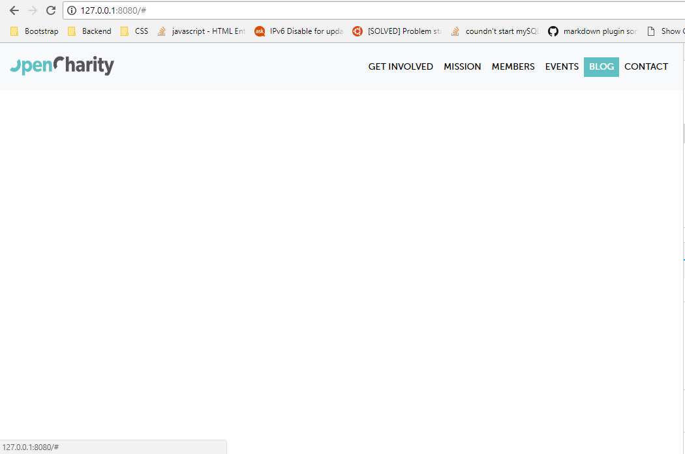
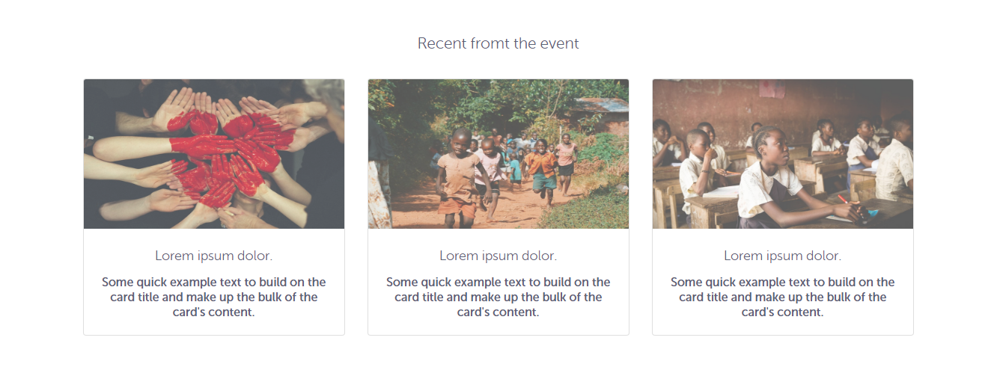
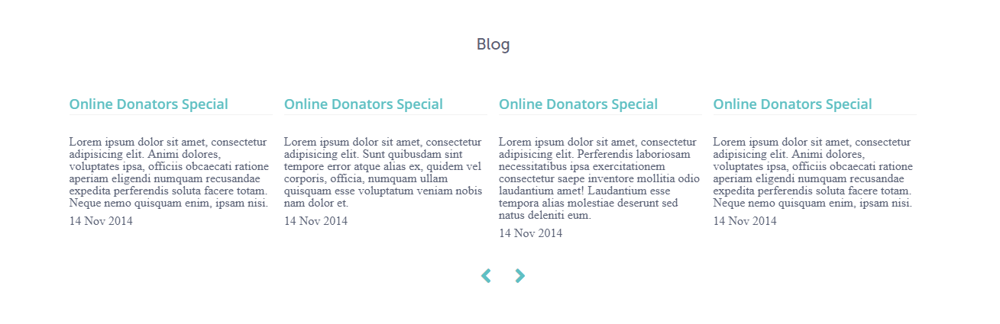
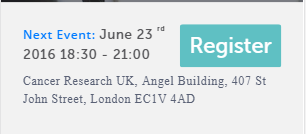

## Chapter 2: OpenCharity Website

#### OpenCharity Overview

**Overview:**

An overview on the website that we are going to clone

- What components is it made up of
- Point out some techniques and features used or built.

**Details:**

**Features**
- Scrollspy
- Blink button effect
- Slider with mouse drag
- Responsiveness

**Bookmarks:**

[A look on the prototype website](https://www.opencharityuk.org/)

#### Prepare Files

**Overview:**

- Build project folder structure
- Convert PSD file to some neccessary assets
- Integrate Bootstrap 4, jQuery and Popper.js

**Details:**

**Step by Step**

1.  Create new project folder with structure below
    
2.  Find and download the following fonts then save them to assets/style/fonts : `Museosans 500` `OpenSans` `OpenSans semibold` `Museosans rounded 300`
3.  Download the OC.PSD file from this [link](https://drive.google.com/drive/folders/1RT0h9PrU0StOmkt0McrEch1dgSouxwXV)
4.  Open file with Photoshop and export neccessary components to PNG, details in here [Trello task](https://trello.com/c/TSCLTjCm)
5.  Inspect colors from PSD file and note them down for later use.
6.  Download Bootstrap 4 and save bootstrap.min.js and bootstrap.min.css in "assets/style/js" and "assets/style/js"
7.  [Download](https://code.jquery.com/jquery-3.3.1.slim.min.js) and save jquery-3.3.1.slim.min.js in "assets/style/js"
8.  [Download](https://cdnjs.cloudflare.com/ajax/libs/popper.js/1.14.3/umd/popper.min.js) and save popper.min.js in "assets/style/js"
9.  Go to [Bootstrap Starter Template](https://getbootstrap.com/docs/4.1/getting-started/introduction/#starter-template) and copy paste its content to index.html

**Now we are ready**

**Bookmarks:**

Link to GitHub Project: [OpenCharity](https://github.com/duyphaphach/Open-Charity)

#### Linking Files Implementing Style sheet

**Overview:**

Link CSS and JS files to index.html

Implement CSS of our own with less

**Details:**

**Features:**

**Using LESS**

Use variables for code reuse and function darken().

**CSS Reset**

Is a short, often compressed (minified) set of CSS rules that resets the styling of all HTML elements to a consistent baseline.

Why use CSS Reset ?

Every browser has its own default ‘user agent’ stylesheet, that it uses to make unstyled websites appear more legible.Using a CSS Reset, CSS authors can force every browser to have all its styles reset to null, thus avoiding cross-browser differences as much as possible.

**Style Sheet Implementation**

- Declare some variables that hold values of mainly-used colors and font-families
- CSS reset
- Customize components that will be used like headers, buttons, list, anchors.

**Bookmarks:**

Link to GitHub Project: [OpenCharity](https://github.com/duyphaphach/Open-Charity)

#### Navbar Part 1

**Overview:**

Implement styles for Navigation Bar

**Details:**

- Display favicon
- Display Open Charity logo
- Implement navbar, navbar links and navbar items styles
  - Add padding
  - Add hover effect
  - Add transition
  - Change font
  - Change background color

The Navbar now look like this

**Bookmarks:**

Link to GitHub Project: [OpenCharity](https://github.com/duyphaphach/Open-Charity)

#### Navbar Part 2

**Overview:**

 Implement event-handlers for Navigation bar

**Details:**

**Effect implemented**

- Close Responsive menu when a link is clicked
- Activate scrollspy to add active class to navbar items on scroll
- On scroll down if the offset is higher than 50px the navbar shrink

**Note**

`@media` rule CSS: The `@media` rule is used in media queries to apply different styles for different media types/devices.

Media queries can be used to check many things, such as:

- width and height of the viewport
- width and height of the device
- orientation (is the tablet/phone in landscape or portrait mode?)
- resolution

Details about syntax and usage are in Bookmarks

**Bookmarks:**

Link to GitHub Project: [OpenCharity](https://github.com/duyphaphach/Open-Charity)

[@media rule in CSS](https://www.w3schools.com/cssref/css3_pr_mediaquery.asp)

#### Header Part 1

**Overview:**

 Implement page header sections

**Details:**

**Components implemented**

- Header with centered inspiration texts
- Event introduction and schedule section
- Register button

**Note**

- Can use the `Text tool` of Photoshop to extract text from PSD file

**Bookmarks:**

Link to GitHub Project: [OpenCharity](https://github.com/duyphaphach/Open-Charity)

#### Header part 2

**Overview:**

 Finish page header sections

**Details:**

**Components implemented**

- Add background image for header
- Change background-color footer
- Add border-bottom footer
- Reposition event detail and `Register` button
- Change color and font of texts

**Note**

- You may confuse about background css properties. Read more in the Bookmarks.

**Bookmarks:**

Link to GitHub Project: [OpenCharity](https://github.com/duyphaphach/Open-Charity)

[CSS background properties](https://www.w3schools.com/css/css_background.asp)

#### Get involved section

**Overview:**

Implement UI for get-involved section

**Details:**

**Components implemented**

- Add Group Logos, Sologans, and Intro

**Note**

**Differences between inline elements and block-inline elements**

Elements with `display:inline-block` are like `display:inline` elements, but they can have a width and a height. That means that you can use an inline-block element as a block while flowing it within text or other elements.

Difference of supported styles as summary:

- inline: only margin-left, margin-right, padding-left, padding-right
- inline-block: margin, padding, height, width

**Bookmarks:**

Link to GitHub Project: [OpenCharity](https://github.com/duyphaphach/Open-Charity)

[Inline block and inline elements](https://stackoverflow.com/questions/8969381/what-is-the-difference-between-display-inline-and-display-inline-block#a-visual-answer)

#### Mission section

**Overview:**

Implement UI for Mission Section

**Details:**

**Components implemented**

Section with `id = mission` containing:

- Three col represent three mission
- Cols contain a card with icon, title and content

**Note**

**`border-radius` CSS property**

The border-radius property defines the radius of the element's corners.

This property allows you to add rounded corners to elements!

This property can have from one to four values. However there are other rules, see in the Bookmarks

**Bookmarks:**

Link to GitHub Project: [OpenCharity](https://github.com/duyphaphach/Open-Charity)

[border-radius CSS](https://www.w3schools.com/cssref/css3_pr_border-radius.asp)

#### Members section

**Overview:**

Install Owl Carousel 2

Implement UI for Member Section

**Details:**

**Implementation**

Owl Carousel 2

- What is it ?
- Owl Carousel is a touch enabled jQuery plugin that lets you create a beautiful responsive carousel slider.
- Why use Owl Carousel 2 over Bootstrap Carousel ?
  - Fully Customisable: Over 60 options. Easy for novice users and even more powerful for advanced developers.
  - Touch and Drag Support: Designed specially to boost mobile browsing experience. Mouse drag works great on desktop too!
  - Fully Responsive: Almost all options are responsive and include very intuitive breakpoints settings.
  - Modern Browsers: Owl uses hardware acceleration with CSS3 Translate3d transitions. Its fast and works like a charm!
  - Zombie Browsers: CSS2 fallback supported for older browser.
  - Modules and Plugins: Owl Carousel supports plugin modular structure. Therefore, you can detach plugins that you won't use on your project or create new ones that fit your needs
- Steps to Install
  - Download Owl Carousel 2
  - Move to dist folder. Copy `owl.carousel.min.js` to /assets/style/js
  - Move to dist/assets folder. Copy `owl.theme.default.min.css` `owl.carousel.min.css` to /assets/style/css
- How to used
  - Put class `owl-carousel` and `owl-theme` on the `div` where you want the carousel to appear
  - Then put on images inside as carousel items
- JavaScript
  - Call Carousel constructor with syntax: $('&lt;div_id>').owlCarousel({
          &lt;Object containing setting properties>
        })
- Result
    

**Note**

Checkout the list of options for Additional Carousel settings in the Bookmarks.

**Bookmarks:**

Link to GitHub Project: [OpenCharity](https://github.com/duyphaphach/Open-Charity)

[Carousel Settings](https://owlcarousel2.github.io/OwlCarousel2/docs/api-options.html)

#### Event section

**Overview:**

Implement UI for Event Section

**Details:**

**Implementation**

- Using Bootstrap `card` to make three columns containing three cards describing three recents events
- Result

    

**Note**

**Bookmarks:**

Link to GitHub Project: [OpenCharity](https://github.com/duyphaphach/Open-Charity)

#### Blog section

**Overview:**

Implement UI for Blog Section

**Details:**

**Implementation**

- Using Owl Carousel 2 to create a slider with 4 blogs
- Result
      

**Note**

**Bookmarks:**

Link to GitHub Project: [OpenCharity](https://github.com/duyphaphach/Open-Charity)

#### Contact Section and Footer

**Overview:**

Implement UI for Contactc Section
Implement UI for Footer

**Details:**

**Implementation**

- Implement Contact form with input fields `Name`, `Email`, and `Message` textarea
- Result
      
- Implement Footer with social sharing buttons `Facebook`, `Twitter` and `Google Plus`
- Result
    

**Note**

- Always structure css similar to HTML to minimize code repetition and narrow down css effects range.

**Bookmarks:**

Link to GitHub Project: [OpenCharity](https://github.com/duyphaphach/Open-Charity)

#### Enhancements

**Overview:**

Add animation, fix responsive bugs, make changes to UI

**Details:**

**Implementation**

- Integrate Animate.css library
  - Go to <https://daneden.github.io/animate.css/>
  - Click on `Download Animate.css`
  - Save content as `animate.css` to following path: `./assets/style/css/animate.css`
- Add flash animation to `Slack Group` button
- Active Scrollspy to `navbar`
- Smooth Scrolling with jQuery
- Add fade in effect to `Mission Section`
- Change letter-spacing of Event Footer for better mobile look
  - Before
        
  - After
        

**Note**

**Bookmarks:**

Link to GitHub Project: [OpenCharity](https://github.com/duyphaphach/Open-Charity)

#### Testing

**Overview:**

Cover some remaining issues about UI, animation
Increase website performance
Do some testing

**Details:**

**Issues Spotted**

**Compressing Image**

Steps

- Go to <https://imagecompressor.com/>
- Upload all project images and wait for image compressing to complete
- Download them all and replace old images with new ones

**Cross-browser Testing**

Try out website on different browser and make sure everything works fine

**Animation**

Add `fade in up` animation to header

**With Mobile devices**

Remove `fade in` animation from Mission Section while on mobile cuz mobile does not have hover effect

**Put website online**

Steps

- Go to <https://app.netlify.com/drop>
- Drag and Drop your project folder into white box
- Wait for uploading and enjoy.

[My website](https://opencharity97.netlify.com/)

**W3C markup validation service**

What is ?

- The Markup Validator is a free service by W3C that helps check the validity of Web documents.
- Most Web documents are written using markup languages, such as HTML or XHTML. These languages are defined by technical specifications, which usually include a machine-readable formal grammar (and vocabulary). The act of checking a document against these constraints is called validation, and this is what the Markup Validator does

How to use

- Go to <https://validator.w3.org/about.html>
- Paste your website url on the input
- Click `Check` and wait for result

**Website Speed Test**

- Go to <https://tools.pingdom.com>
- Paste website url into the input
- Click `Start Test` and wait for result

**Note**

**Bookmarks:**

Link to GitHub Project: [OpenCharity](https://github.com/duyphaphach/Open-Charity)

#### Recap

**Overview:**

Review what we have built so far

**Details:**

- How we can export images from PSD file as well as getting colors and fonts for our website
- Then moving to setting our variables and style sheet
- Learned how to nest our code in `less` so it's more readable, understandable.
- Learned how to use Bootstrap 4 and its components plus adding animation to our project with `jQuery` or `Animate.css`
- Learned how to organize our project by applying our `Trello` steps that we had written before starting
- Learned how to write clean code with comment
- Dealt with responsive part so our website is available on all devices
- Increase website performance and run the markup and speed test

**Bookmarks:**

Link to GitHub Project: [OpenCharity](https://github.com/duyphaphach/Open-Charity)
