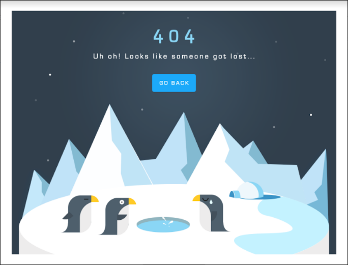
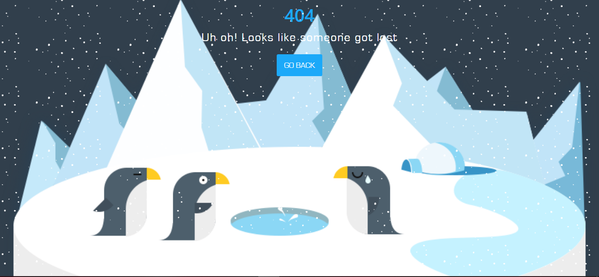

## Chapter 3: 404 Penguins Page

#### 404 Overview

**Overview**

An overlook on what we gonna build

**Details**

Prototype

**Target**

- Create snowfall animation
- Make image stick to the page bottom no matter screen size

**Components**

- 404 logo
- Error message
- `Go back` button
- Sticky background image
- Snowfall animation

**Bookmarks**

#### Prepare Files

**Overview**

Bootstrap the project

**Details**

**What we gonna use**

- `bootstrap.min.css`
- CSS keyframe

**Building folder structure**

The folder structure is pretty similar to `OpenCharity` project

**Bootstraping steps**

- Go to <https://drive.google.com/drive/folders/1WAn16FJ0s-6j1DiR2-LcJ9HAQoPlIBGY> to download PSD file and save it to project
- Go to <https://www.dafontfree.net/freefonts-eurostile-f484.htm> to download eurostile font
  - Use photoshop to extract neccessary images.
  - One penguin for favicon
  - Three penguins with iceberg as background
- Note down colors to be used.
- Put   `bootstrap.min.css` into .assets/style/css
- Run following commands `git init`, `echo > README.md`, `git add .`, `git commit -m "Bootstrap project"`

**Bookmarks**

[Eurostile font](https://www.dafontfree.net/freefonts-eurostile-f484.htm)

[PSD File](https://drive.google.com/drive/folders/1WAn16FJ0s-6j1DiR2-LcJ9HAQoPlIBGY)

#### Start code

**Overview**

Implement UI
Styling Page
Add animation

**Details**

**Components implemented**

- One wrapper container containing
  - Header: 404 with response text and `GO BACK` button
  - One image as background
  - One `div` to handle the animation

**Styling**

Mainly used colors and fonts

@gray_color: #313f4c;
@blue-color: #1ca9f9;
@white-color: #ffffff;
@Eurostile: 'Eurostile';

Animation was created using CSS `@keyframe`. It's a long explaination. Check out the Bookmarks

**Result**

**Bookmarks**

[CSS keyframe](https://css-tricks.com/snippets/css/keyframe-animation-syntax/)

Link to GitHub project [404 Penguins Page](https://github.com/duyphaphach/404-penguins-page)

#### 404 Recap

**Overview**

Advices on project

**Details**

- If you fail try again and again
- Should not add animation to every section cuz it could be annoying
- Mention the final project

**Bookmarks**

Link to GitHub project [404 Penguins Page](https://github.com/duyphaphach/404-penguins-page)
