## Chapter 4: Merkury Website

#### Merkury Overview

**Overview**

Discuss on what are we going to build

What will we learn along the project

And some small reminders

**Details**

**What are we building**

An introductory website of the merkury dashboard which displays:

- The important features
- The workflow
- The powerful design of the Merkury dashboard

**What are we learning**

Making powerful animation by CSS and positioning elements

Deal with two different plugins: `scroll reveal` and `jQueryUI`

**Components to implement**

**The Navbar**

- Apply transition effect
- Apply Scrollspy
- Collapse Navbar when item clicked by jQuery

**The Header**

- Chart animation in the background
- A title and a subtitle
- A `Get Started` button with a nice hover effect
- An image display between header and features section

**Features Section**

First Part

- Images represent features of the dashboard with cool over effect
- A short description text with `See more` button below

Second Part

- On the left, we have title and some text
- On the right side, we have image with the fade-in animation

**Drag and Drop Section**

- On the right, a title with some text and two navigation button
- On the left, we have customize drop down button, allow drag and drop item

**Special Section**

- Title and some text
- Running line effect when hover
- Infinite floating effect on the image

**Pricing Section**

- Three Bootstrap card with fade-up-in effect with different delay

**Join Section**

- A text with `Join now!` and separate line

**Footer Section**

- All right reserved and social buttons

Some visual images

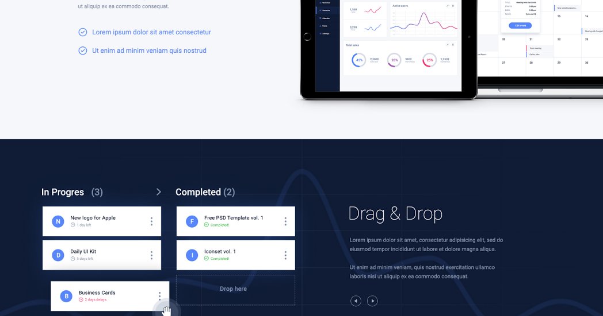

**Note**

Our website will be mobile first, which mean it have to fit any devices

And never forget the Testing part

**Bookmarks**

None

#### Prepare Files

**Overview**

Build folder structure

Extract images and colors from PSD

**Details**

**Folder structure**

Similar to OpenCharity folder structure

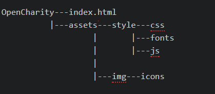

**Colors used**

dark-blue-color: #oe1a35;

light-blue-color: #5584ff;

light-grey-color: #8492af;

black-color: #000000;

white-color: #ffffff;

**Fonts used**

Roboto-regular-font
Roboto-bold-font
Roboto-thin
Roboto-medium
Montserrat-regular
Montserrat-bold
Font-awesome

**Include libraries**

**Bootstrap**

- Download `bootstrap.min.css` and `bootstrap.min.js` from [Bootstrap Download Link](https://getbootstrap.com/docs/4.1/getting-started/download/)
- Save them into `./assets/style/css/` and `./assets/style/js/`

**jQuery**

- Go to [jQuery Download](https://code.jquery.com/jquery-3.3.1.min.js) and save it to `./assets/style/js/`

**Popper.js**

- Go to [Popper Download](https://cdnjs.cloudflare.com/ajax/libs/popper.js/1.11.0/umd/popper.min.js) and save it to `./assets/style/js/`

**Bookmarks**

None

#### Linking Files

**Overview**

Link image and library with index.html

Apply some custom CSS

**Details**

**Linking Files**

The index html should appear like below

**Custom CSS**

- Define `fontface`s
- Assign colors and fonts to variables
- Copy General Reset CSS code from Open Charity project into `style.less`
- Customize some tag with background-color, margin and padding

**Bookmarks**

Link to [GitHub Project](https://github.com/duyphaphach/Merkury-Website)

#### Navbar Part 1

**Overview**

Implement styles for Navigation Bar

**Details**

**Implementation**

- Display favicon
- Display Merkury logo
- Implement navbar, navbar links and navbar items styles
  - Add padding
  - Add hover effect
  - Add transition
  - Change font-family
  - Change background color

**Result**

The background of navbar is transparent at present because it will inherit the website background later on

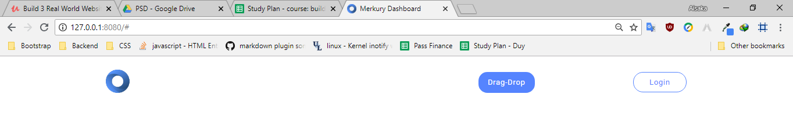

**Bookmarks**

Link to [GitHub Project](https://github.com/duyphaphach/Merkury-Website)

#### Navbar Part 2

**Overview:**

Add some enhancements to make our navbar more interactive

**Details:**

**Effect implemented**

- Close Responsive menu when a link is clicked
- Activate scrollspy to add active class to navbar items on scroll
- On scroll down if the offset is higher than 50px the navbar shrink and change color

**Result**

- Navbar Before shrinking

    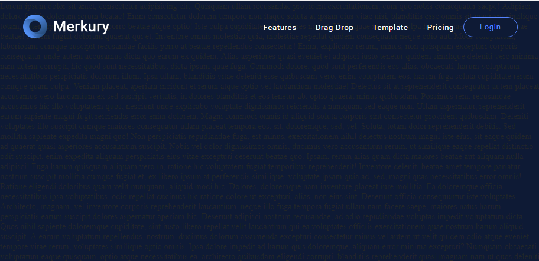

- Navbar After shrinking

    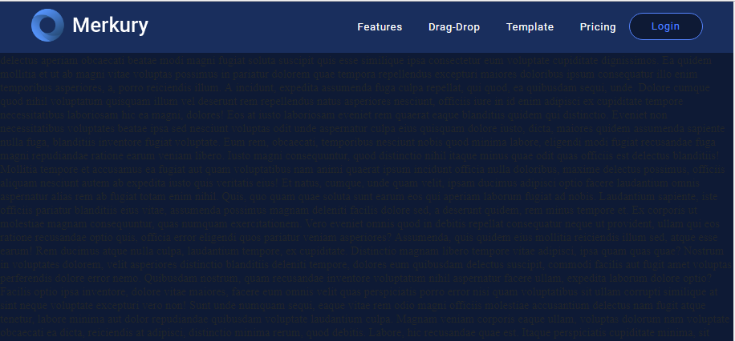

**Note**

Remind of media rule

`@media` rule CSS: The `@media` rule is used in media queries to apply different styles for different media types/devices.

Media queries can be used to check many things, such as:

- width and height of the viewport
- width and height of the device
- orientation (is the tablet/phone in landscape or portrait mode?)
- resolution

Details about syntax and usage are in Bookmarks

**Bookmarks**

Link to [GitHub Project](https://github.com/duyphaphach/Merkury-Website)

[@media rule in CSS](https://www.w3schools.com/cssref/css3_pr_mediaquery.asp)

#### Header

**Overview:**

 Implement UI for page header sections

**Details:**

**Components implemented**

- A title, a sologan and `Get started` button below
- Dashboard image with glowing sides extracted from PSD
- Grid background with chart on top
- Chart background with left-to-right linear moving effect

**Result**

**Note**

- Remind of CSS `@keyframe`, checkout link in the Bookmarks

**Bookmarks:**

Link to [GitHub Project](https://github.com/duyphaphach/Merkury-Website)

[CSS keyframe](https://css-tricks.com/snippets/css/keyframe-animation-syntax/)

#### Service Section

**Overview:**

Implement UI service section

**Details:**

**Components implemented**

- Three columns represent three service with logo, title and detail text
- A `See More` button with hover effect
- Light gray divider between each image

**Styling**

- Customize font weight, font size and font family on titles and texts
- Add hover effect on `See More` button
- Add hover effect on logo images

**Result**

**Note**

- Psuedo element `::after`

**What is it?**

`::after` is a pseudo element which allows you to insert content onto a page from CSS (without it needing to be in the HTML). While the end result is not actually in the DOM, it appears on the page as if it is, and would essentially be like this:

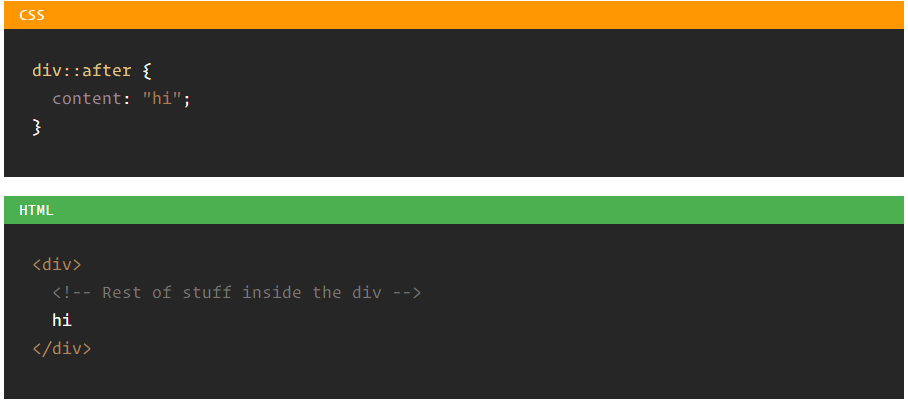

The capability of psuedo elements is tremendous. Check out the Bookmarks

**Bookmarks:**

Link to [GitHub Project](https://github.com/duyphaphach/Merkury-Website)

[Psuedo Elements CSS](https://css-tricks.com/almanac/selectors/a/after-and-before/)

#### Features Section

**Overview:**

Implement UI for Features section

**Details:**

**Components implemented**

- Two Column, one take care of the text and one contains the image
- The text includes: A title, a paragraph and two checkpoints.

**Styling**

- Customize font weight, font size and font family on titles and texts
- Add padding and margin so everything look balanced

**Result**

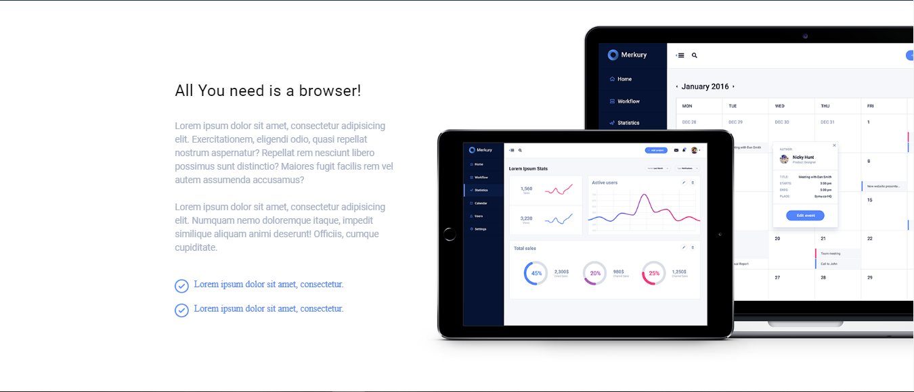

**Note**

Nothing

**Bookmarks:**

Link to [GitHub Project](https://github.com/duyphaphach/Merkury-Website)

[Psuedo Elements CSS](https://css-tricks.com/almanac/selectors/a/after-and-before/)

#### Drag and Drop Section Part 1

**Overview:**

Implement skeleton for Drag and Drop section

**Details:**

**Components implemented**

- Three Column, one take care of the text and one contains card represent In-progress tasks, one contains card represent Completed tasks
- The text includes: A title, a paragraph and two checkpoints.

**Result**

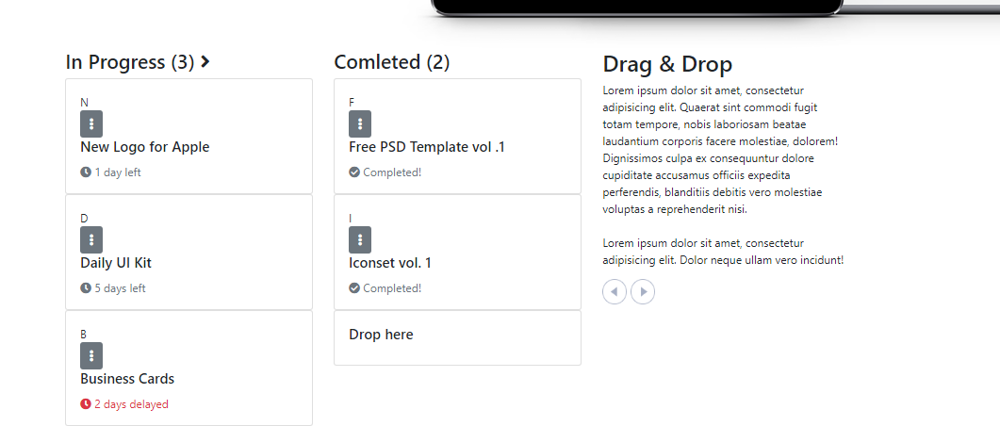

**Note**

Nothing

**Bookmarks:**

Link to [GitHub Project](https://github.com/duyphaphach/Merkury-Website)

#### Drag and Drop Section Part 2

**Overview:**

Implement Style for Drag and Drop section

**Details:**

**Requirement**

Download and install jQueryUI from [here](https://jqueryui.com/resources/download/jquery-ui-1.12.1.zip)

Copy and paste `jquery-ui.min.js` into `./assets/style/js`

**Styling**

- Add Grid background to `#drag-drop` section
- Add Chart background to `.container` and apply animation on using `@keyframe`
- Add padding and margin to cards to to make them look nicer
- Turn `dropdown` button to ellipsis
- Turn mouse to crossarrow when hover on draggable item

**Effect**

- Efface the border and `Drop here` text from the `#droppable` item  when a card is dropped onto using jQueryUI
- Restrict dragging to horizontally.

**Result**

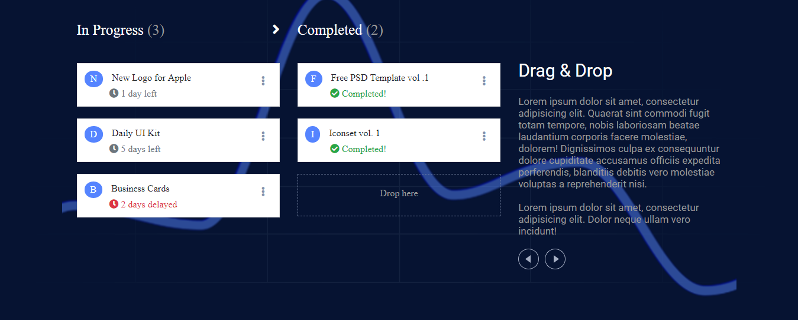

**Note**

Draggable and Droppable are just two of many interactions supported by jQueryUI. Find out more in the Bookmarks

**Bookmarks:**

Link to [GitHub Project](https://github.com/duyphaphach/Merkury-Website)

[More on jQueryUI](https://jqueryui.com/draggable/)

#### Template Section

**Overview:**

Implement UI for Template section

**Details:**

**Idea**

- A header at the top, horizontally centered
- Some description below
- Two animated line running until reach the dashboard at the middle
- Two paragraph float left and right from where the animation start
- The dashboard image will fade up at the beginning then float infinitely
- All animation start when the section got hovered on

**Components implemented**

- First row contain the one Header, one sub-text
- Second row contains three Columns, one left-side, one right-side, one middle
- Left-side and right-side col contain a title, a paragraph, the middle one contain an image as background

**Styling**

- Customize font and color of header and text

- Add animation on side columns using `::before` and `@keyframes`: a blue circle running toward the center image

- Apply floating effect on the center image

**Result**

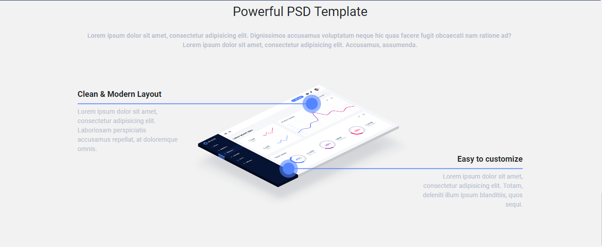

**Note**

- Remind of CSS `@keyframe`, checkout link in the Bookmarks

**Bookmarks:**

Link to [GitHub Project](https://github.com/duyphaphach/Merkury-Website)

[CSS keyframe](https://css-tricks.com/snippets/css/keyframe-animation-syntax/)

#### Pricing Section

**Overview:**

Implement UI for Pricing section

Remind of `box-shadow` CSS property

**Details:**

**Components implemented**

- Three Column, representing three pricing model: BRONZE, SILVER and GOLD

- Column contain title, price, benefits (blue-check circle) and fallbacks (x-circle) of each model

**Styling**

- Customize font and color of header and text

**Result**

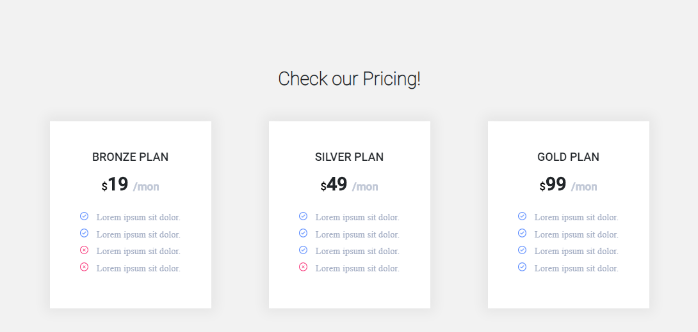

**Note**

- Box shadow CSS property params explain:
  - **The horizontal offset** (required) of the shadow, positive means the shadow will be on the right of the box, a negative offset will put the shadow on the left of the box.
  - **The vertical offset** (required) of the shadow, a negative one means the box-shadow will be above the box, a positive one means the shadow will be below the box.
  - **The blur radius** (required), if set to 0 the shadow will be sharp, the higher the number, the more blurred it will be, and the further out the shadow will extend. For instance a shadow with 5px of horizontal offset that also has a 5px blur radius will be 10px of total shadow.
  - The spread radius (optional), positive values increase the size of the shadow, negative values decrease the size. Default is 0 (the shadow is same size as blur).
  - Color (required) - takes any color value, like hex, named, rgba or hsla. If the color value is omitted, box shadows are drawn in the foreground color (text color). But be aware, older WebKit browsers (pre Chrome 20 and Safari 6) ignore the rule when color is omitted.
- Using a semi-transparent color like rgba(0, 0, 0, 0.4) is most common, and a nice effect

Find out more about `box-shadow` in the Bookmarks

**Bookmarks:**

Link to [GitHub Project](https://github.com/duyphaphach/Merkury-Website)

[Box Shadow CSS](https://css-tricks.com/almanac/properties/b/box-shadow/)

#### Join and Footer Section

**Overview:**

Implement UI for Join Section
Implement UI for Footer Section
Remind of `:before`, `:after` and `display: flex`

**Details:**

**Components implemented**

- Join Section: A presentation text with `Join now!` button below
- Footer Section: Copyright text float left, `Pricing`, `Blog`, `Contact` and social links float right

**Styling**

- Customize font and color of text, icon, style `Join now!` button
- Apply `::before` and `::after` to `Join now!` button

**Result**

**Note**

**Remind of psuedo classes**

- Psuedo element `::after`
- Psuedo element `::before`

**What is it?**

Pseudo element allows you to insert content onto a page from CSS (without it needing to be in the HTML). While the end result is not actually in the DOM, it appears on the page as if it is, and would essentially be like this:

The capability of psuedo elements is tremendous. Check out the Bookmarks

**Remind of `flex-box` CSS**

Flexbox is the secret behind Bootstrap's grid system, help you build neat and responsive layout
Checkout the tutorial in the Bookmarks

**Bookmarks:**

Link to [GitHub Project](https://github.com/duyphaphach/Merkury-Website)

[Psuedo Elements CSS](https://css-tricks.com/almanac/selectors/a/after-and-before/)

[Flexbox CSS](https://css-tricks.com/snippets/css/a-guide-to-flexbox/)

#### Enhancements

**Overview:**

Make website more responsive

Apply some effect to increase/// smoothness

**Details:**

**Enhancements**

Test the website with every screen size and make sure everything looks nice

* * *

Apply Scrollspy

* * *

Apply Smooth Scrolling: Copy the code from this [link](https://css-tricks.com/snippets/jquery/smooth-scrolling/#article-header-id-1) and paste it into `main.js`

* * *

/
Apply Scroll Reveal

What is Scroll Reveal ?

ScrollReveal is a JavaScript library for easily animating elements as they enter/leave the viewport.

It was designed to be robust and flexible, but hopefully you’ll be surprised below at how easy it is to pick up.

Steps:

1.  Go to <https://github.com/scrollreveal/scrollreveal> to download the library
2.  Paste the srollreveal.min.js into our js folder
3.  Initialize effect on an element by using this syntax:
    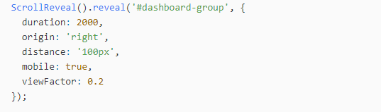
4.  Checkout all options of the library through the link in Bookmarks section

**Note**

If using jQuery, check every jQuery effect with browser reload.

**Bookmarks:**

Link to [GitHub Project](https://github.com/duyphaphach/Merkury-Website)

[Scroll Reveal Doc](https://scrollrevealjs.org/api/reveal.html)

#### Testing

**Overview:**

- See what can we improve

**Details:**

**Compressing images**

Upload images to [Optimizilla](https://imagecompressor.com/) to minify images

* * *

**Cross-browser testing**

Open website on others browser to make sure it works everywhere

* * *

**Put website online**

The same as we did with OpenCharity website: Go to <https://app.netlify.com/sites/tender-banach-172fcd/overview> to deploy your website to Netlify

[Link to deployed website](https://merkury007.netlify.com/)

* * *

**Markup Validation Service**

Go to [W3C Markup Validation Service](https://validator.w3.org) to check for error in your markup files

Only one warning with lang property of `html` tag

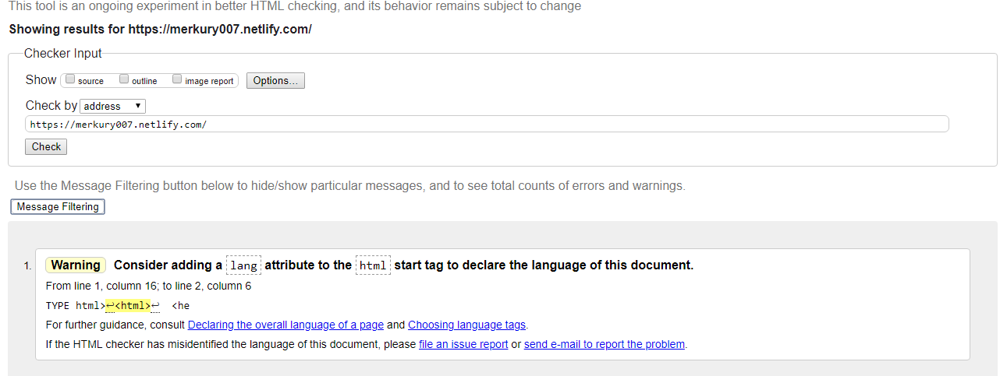

* * *

**Website speed test**

Test result from [Pingdom](https://tools.pingdom.com/#!/eOs1jz/https://merkury007.netlify.com/)

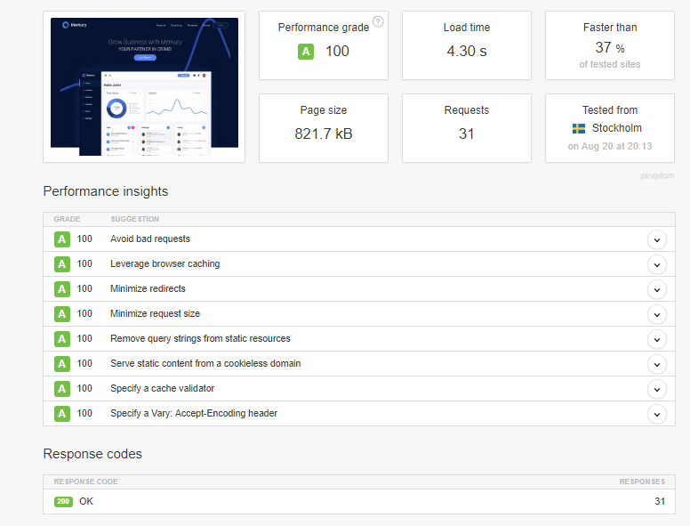

**Note**

**Bookmarks:**

Link to [GitHub Project](https://github.com/duyphaphach/Merkury-Website)

#### Recap

**Overview:**

- Revise what we have learnt so far

**Details:**

**Learned**

- How to export images, getting colors from PSD files
- Prepare project files and folders using Trello to-do list
- Setting variables and custom stylesheet for our website
- How to nest CSS code in less for better understanding and readability
- How to use Bootstrap 4 and its components
- Create animations using CSS, jQuery or normal JS
- Dealt with two different plugins jQueryUI and ScrollReveal and know how to customize them
- Write clean code with comments
- Dealt with website responsiveness
- Increase website performance by compressing images, running markup test and speed test to know what to improve

**Fallbacks**

- Still need a lot more practices on CSS, CSS animations, jQuery, jQueryUI cuz what the course brought are just the tip of the iceberg.

**Bookmarks:**

Link to [GitHub Project](https://github.com/duyphaphach/Merkury-Website)

#### Important Tips

**Overview:**

- Share some important tips and advices

**Details:**

The best three directions for you as a front-end developer/designer\\

1.  Start learning about CMSs like WordPress or Drupal...
2.  Start learning a backend language like PHP with Laravel framework or Python with Django framework or so on.
3.  Continue improving your JavaScript skills by learning a single page app framework like AngularJS, or ReactJS or VueJS

You don't need to know everything to be productive, just be confident

# COURSE FINISHED: 20:44 PM  20/08/2018
